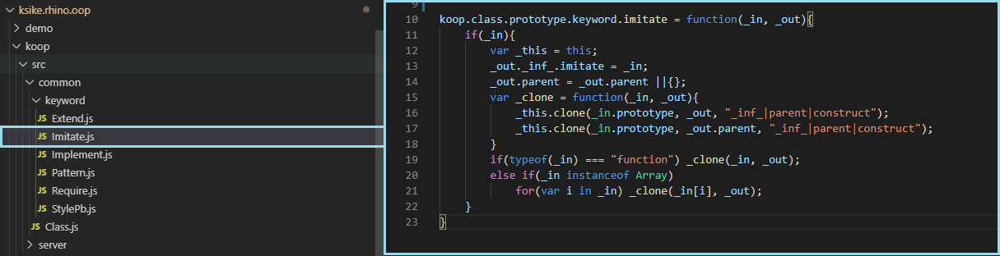

# koop

Ksike Object Oriented Prograning (KOOP), is a library that allows you to create an abstraction layer that promotes and facilitates the use of the object-oriented programming paradigm on the JavaScript language.

KOOP is Written in native JavaScript defines a system of plugins that allow developers to extend the operation of the library, through the prototype of the general interface Class. In this way, all the keywords in the library are implemented.



# 

Ksike Object Oriented Prograning (KOOP), es una biblioteca que permite crear una capa de abstracción que promueve y facilita el empleo del paradigma de programación orientado a objeto sobre el lenguaje JavaScript.

Escrita en JavaScript nativo define un sistema de complementos que permiten a los desarrolladores extender el funcionamiento de la biblioteca, a través del prototipo de la interfaz general denominada Clase. De esta forma están implementadas todas las palabras reservadas de la biblioteca.

# 

Example of use in a web page:
```html
	<!-- IN KOOP js files needed to use the library -->
	<script type="text/javascript" src="../../koop/src/common/Class.js"> </script>
	<!-- Note how the keywords are loaded optionally in order to minimize the load of our applications, in this case only two are used. -->
	<script type="text/javascript" src="../../koop/src/common/keyword/Extend.js"> </script>
	<script type="text/javascript" src="../../koop/src/common/keyword/StylePb.js"> </script>
	<!-- OUT KOOP js files needed to use the library -->
```

Example of use in a javascript file for a web page:
```javascript
	//... Define a base class named Animal
	koop.class("Animal",
	{
		construct: function(name){
			 this.name = name ? name : "";
		},
		shout: function(){
			return "-";
		},
		getName: function(){
			return this.name;
		}
	});
	
	koop.class("Dog",
	{
		extend: Animal,
		construct: function(name, owner){
			//... Redefine the constructor
			this.owner = owner ? owner : "";
			//... Invoke the constructor of the parent class
			this.parent.construct.apply(this, [name]);
		},
		getOwner:function(){
			return this.owner;
		}
	});
	
	//... Creating instances of the classes
	var dog = new Dog("Pluto", "Mickey Mouse");
	//... Invoking functions
	console.log(dog.getName());
	console.log(dog.getOwner());
```
#

Example of use in Node.js:
```javascript
	//... Load the library named KOOP
	require("../../koop");
	//... Define a base class named Animal
	koop.class("Animal",
	{
		construct: function(name){
			 this.name = name ? name : "";
		},
		shout: function(){
			return "-";
		},
		getName: function(){
			return this.name;
		}
	});
	//... Define a Dog class that inherits from Animal
	koop.class("Dog",
	{
		extend: Animal,
		construct: function(name, owner){
			//... Redefine the constructor
			this.owner = owner ? owner : "";
			//... Invoke the constructor of the parent class
			this.parent.construct.apply(this, [name]);
		},
		getOwner:function(){
			return this.owner;
		}
	});
	//... Creating instances of the classes
	var dog = new Dog("Pluto", "Mickey Mouse");
	//... Invoking functions
	console.log(dog.getName());
	console.log(dog.getOwner());
```

For better understanding see the demos and the published documentation.